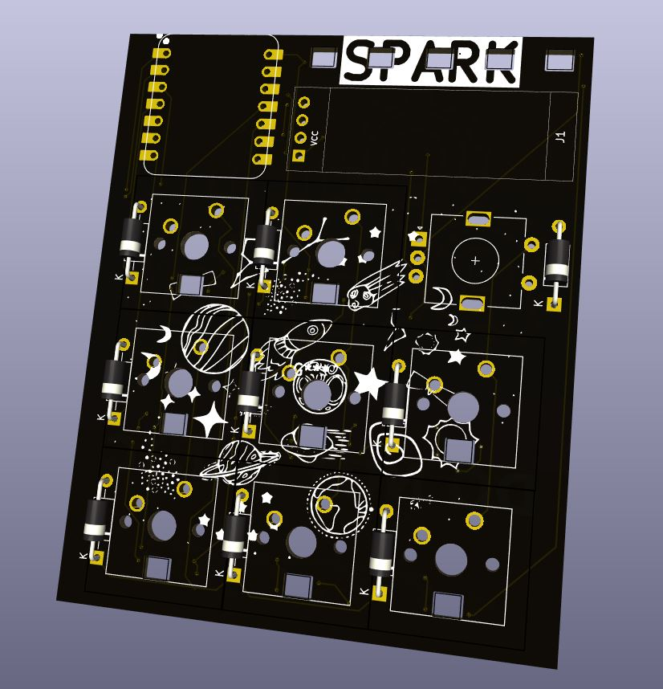
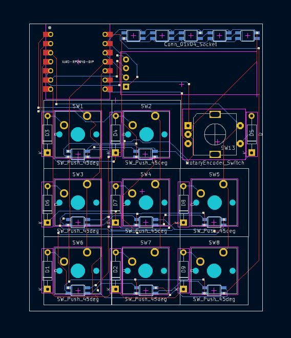
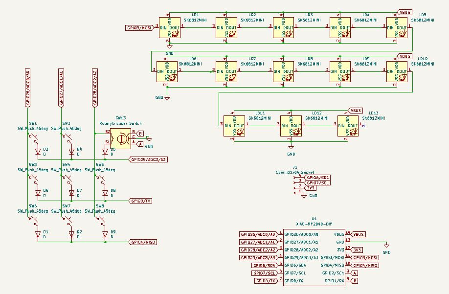
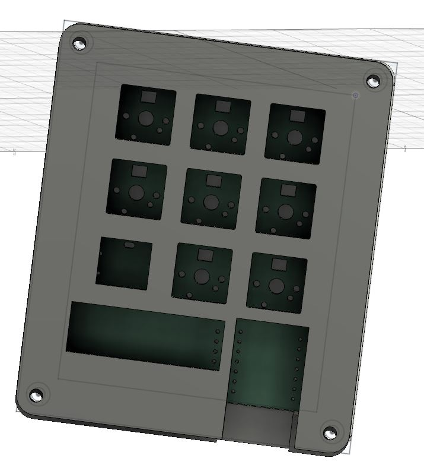

This is an awesome macropad with 8 buttons, 1 rotary encoder, and an OLED screen. All keys have RGB LEDs, with extra indicator LEDs at the top to show status. It runs on KMK firmware and is fully customizable.

